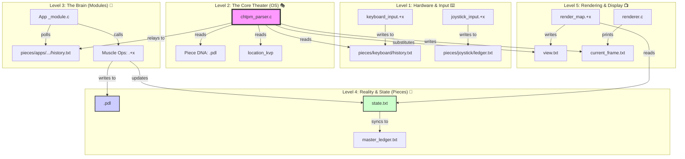

# 📚 TPMOS_TEXTBOOK: The Definitive Guide 🎓
**Welcome, Scholar!** You are about to embark on a journey through the **True Piece Method (TPM)** and the architecture of the **CHTPM+OS Monolith**. This textbook is designed for visual learners and system architects alike. 🚀

---

## 🗺️ Indexed Dependency Graph (The Big Picture)
Below is the flow of data and control within the TPMOS ecosystem. 🕸️

---

## 📖 Table of Contents (The Curriculum)

### 🏫 Part I: Foundations
*   **[Chapter 1: The Soul of a Piece](CH1_PHILOSOPHY.md)** 🧬
    *   *What is TPM? PIECE -> MODULE -> OS.*
*   **[Chapter 2: The Filesystem is the Database](CH2_FILE_SYSTEM.md)** 📁
    *   *Directory structures, location_kvp, and why "Memory is a Lie".*

### ⚙️ Part II: The Machinery
*   **[Chapter 3: The 12-Step Pulse](CH3_PIPELINE.md)** 💓
    *   *Walking through a single frame from keystroke to pixels.*
*   **[Chapter 4: Muscles & Brains (Ops & Modules)](CH4_DEVELOPMENT.md)** 💪
    *   *How to write CPU-safe C code for the PMO ecosystem.*

### 🛠️ Part III: Advanced Systems
*   **[Chapter 5: The App Factory](CH5_SYSTEM_APPS.md)** 🏭
    *   *Exploring op-ed, gl_os, and the user management system.*
*   **[Chapter 6: Beyond ASCII (GL-OS)](CH6_GL_OS.md)** 🎨
    *   *The future of 3D visualization and high-fidelity rendering.*

### 🛡️ Part IV: The Final Frontier
*   **[Chapter 7: The Guardians (Testing & Simulation)](CH7_TESTING.md)** 🤖
    *   *How we use AI Bots to test the OS and ensure "KISS" stability.*
*   **[Chapter 8: The Great Expansion (AI, LSR, & P2P)](CH8_FUTURE_HORIZONS.md)** 🛰️
    *   *AI-Labs, Lunar Civilizations, and the P2P Blockchain.*

### 🌀 Part V: The Recursive Forge
*   **[Chapter 9: The Infinite Loop (Circuits & Auto-Battlers)](CH9_RECURSIVE_FORGE.md)** ⚡
    *   *RPGMaker compliance, recursive chip design, and PAL-driven combat.*
*   **[Chapter 10: The Simulation Theater (From Atoms to Earth)](CH10_SIMULATION_THEATER.md)** 🧪🌍
    *   *Anatomy, chemistry, market predictors, and cosmological twins.*
*   **[Chapter 11: Piecemark Labs & The Sovereign Venture](CH11_BUSINESS_STRATEGY.md)** 💼📈
    *   *Stealth growth, B2X models, and crypto legal roadmaps.*
*   **[Chapter 12: The Soul Pen & The Multiverse](CH12_SOUL_PEN.md)** 🪄🌌
    *   *3D-printing wands, cosmic franchises, and multiversal creation.*

---

### 🎓 Extra Credit & Reference
*   **[Glossary of Terms](GLOSSARY.md)** 📖
    *   *PJARGO, PMO, and TPM definitions.*
*   **[The Final Exam (Q&A)](QUIZ.md)** 📝
    *   *Test your knowledge of the Mono-OS.*

---
"Softness wins. The empty center of the flexbox holds ten thousand things." 🧘‍♂️
